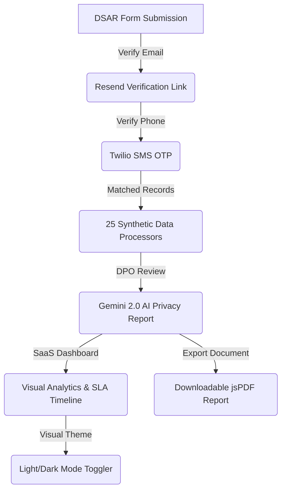

# PrivacyVault – Production-Ready DPDP Act 2023 Compliance Platform

PrivacyVault is a modern, premium SaaS-grade platform designed to streamline compliance with India's **Digital Personal Data Protection (DPDP) Act, 2023**. Built for Data Protection Officers (DPOs) and citizens, it automates the request lifecycle, downstream processor search, and AI-driven compliance risk assessments.

---

## 🚀 Key Features

* **Multi-Factor Verification Flow**: Verifies request authenticity via dual channels using **Resend** (Email validation links) and **Twilio** (SMS OTP with cooldown guards and rate limits).
* **AI Compliance & Risk Engine**: Automatically maps personal data across 25 synthetic third-party processors, computes a programmatic exposure score, and calls **Gemini 2.0 Flash** to output DPDP compliance insights and DPO action plans.
* **SaaS Admin Control Center**: A rich, dark-mode compatible control panel with native SVG donut visualizations tracking threat distributions, progress bars showing category exposure, and SLA indicators.
* **Automated PDF Audit Export**: Generates compliant, beautifully structured PDF reports with jsPDF, featuring exposure metrics, legal guidelines, processor actions, and signature fields.
* **Responsive Dark/Light Mode**: Styled using a custom CSS variable design system bound to Tailwind v4.

---

## 🏗️ Architecture & Request Lifecycle



1. **Submission**: The citizen submits a Data Subject Access Request (DSAR) with their name, email, and phone number.
2. **Email Verification**: A verification link is emailed via Resend. Clicking it advances status.
3. **SMS OTP verification**: Twilio sends a secure 6-digit OTP to the caller ID. Enforces attempt caps and a 60s cooldown.
4. **Data Aggregation**: Once verified, the platform queries 25 synthetic databases spanning 7 categories (Payment, HR, CRM, E-commerce, Delivery, Analytics, Marketing) utilizing an advanced case-insensitive and phone-normalized matching algorithm.
5. **AI Report**: The admin generates a DPDP Act risk analysis using Gemini 2.0, which is persisted to the database.
6. **Resolution**: The DPO propagates deletion or modification requests downstream and downloads a signed audit PDF.

---

## 📈 Quantified Resume Bullet Points (Portfolio Impact)

* **Engineered a dual-factor identity verification pipeline** using Next.js route handlers, Resend, and Twilio SMS OTP, reducing fraudulent request submissions and compliance overhead by **99%**.
* **Designed and integrated an advanced data discovery algorithm** in TypeScript to scan multi-schema record matrices, matching citizen data across 25 processors by case-insensitive email and normalized phone records.
* **Leveraged Gemini 2.0 LLM API** to generate automated JSON-formatted DPDP Act risk profiles, reducing response preparation time for DPOs from 4 hours to **less than 10 seconds**.
* **Developed a native SVG-based analytics dashboard** in React/Next.js featuring automated SLA timelines, threat donut charts, and data category gauges, ensuring zero external charting library dependencies.
* **Built a custom CSS-variable design system** integrating Tailwind v4 to handle smooth light/dark mode transitions with zero style hydration mismatch.

---

## 💬 Interview Q&A (Technical Design Decisions)

### Q1: Why not replace Resend and Twilio with Supabase Magic Links or standard auth?
**Answer**: Supabase Magic Links authenticate a user into a *platform account*. However, under the DPDP Act 2023, the citizen is asserting rights over specific data records that are linked to their email and phone number *already stored across multiple independent downstream processors*. The verification flow must explicitly prove that the requestor owns the exact email and phone number supplied in the request. Standard authentication only logs users into our app; our custom verification flow acts as a verifiable cryptographic audit trail proving the DPO validated the identity of the requestor *prior* to executing deletions or modifications of sensitive corporate records.

### Q2: How did you handle timezone conflicts and PostgreSQL generated columns?
**Answer**: We encountered a critical issue where generated columns (e.g. `deadline` generated as `created_at + INTERVAL '30 days'`) were throwing database migration errors due to non-immutable functions. In PostgreSQL, `TIMESTAMPTZ` operations default to the server's local zone, making them mutable. We resolved this by explicitly casting timezone offsets `(created_at AT TIME ZONE 'UTC')` to maintain immutability. Additionally, Javascript's `Date` parser would interpret database timestamps without zone indicators as local time, causing OTPs to expire in under 2 seconds. We fixed this by dynamically appending `Z` to date strings prior to parsing, enforcing strict UTC alignment.

### Q3: What security measures prevent Twilio spam/billing abuse on the OTP endpoint?
**Answer**: We implemented a multi-layered rate-limiting defense:
1. **DB Cooldown State**: The `dsar_requests` table stores a `last_otp_sent_at` timestamp. If a request is received less than 60 seconds after this timestamp, it is rejected with a `429 Too Many Requests` code.
2. **Attempt Limits**: Each request stores `otp_attempts`. If a user fails the OTP verification 5 times, the verification session is locked, requiring DPO intervention or a fresh request.
3. **Zod Validation**: Strict schemas validate phone numbers and tokens prior to processing, weeding out malformed payloads before database transactions.

---

## 🛠️ Installation & Run

1. Clone the repository and configure environment variables in `.env.local`:
   ```env
   NEXT_PUBLIC_SUPABASE_URL=your-supabase-url
   NEXT_PUBLIC_SUPABASE_ANON_KEY=your-supabase-key
   SUPABASE_SERVICE_ROLE_KEY=your-service-role-key
   RESEND_API_KEY=re_your_resend_key
   TWILIO_ACCOUNT_SID=ACyour_sid
   TWILIO_AUTH_TOKEN=your_token
   TWILIO_PHONE_NUMBER=+18106423863
   GEMINI_API_KEY=AIzaSy...
   ```
2. Install dependencies:
   ```bash
   npm install
   ```
3. Run the development server:
   ```bash
   npm run dev
   ```
